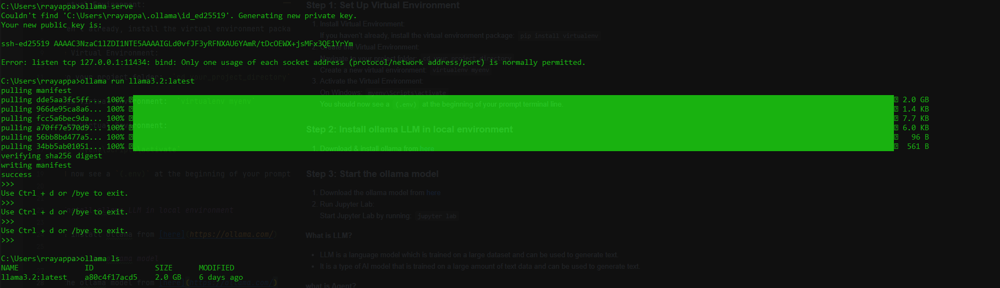
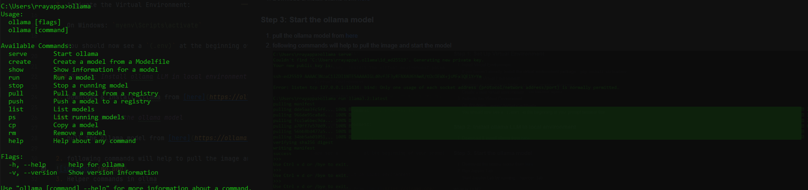

# Exploring Autogen, LLMs

###  Setting up the Development environment

##### Step 1: Set Up Virtual Environment

1. Install Virtual Environment:

   If you haven't already, install the virtual environment package: `pip install virtualenv`

2. Create the Virtual Environment:

   Navigate to your project folder:  `cd your_project_directory`

   Create a new virtual environment:  `virtualenv myenv`

3. Activate the Virtual Environment:

      On Windows: `myenv\Scripts\activate`

      You should now see a `(.env)` at the beginning of your prompt terminal line.


##### Step 2: Install ollama LLM in local environment

1. Download & install ollama from [here](https://ollama.com/)

##### Step 3: Start the ollama model

1. pull the ollama model from [here](https://ollama.com/)

   2. following commands will help to pull the image and start the model
      
   3. Helper commands in ollma
      


#### What is LLM?

- LLM is a language model which is trained on a large dataset and can be used to generate text.

####  what is Agent?

- Agent is the one which take user question and interact with multiple tools and provide this info to LLM to get the desired answer

# Autogen

- Autogen is Microsoft open source programming framework that allows developers to build AI agents.

-  **Key Components of Autogen:**
   -  Conversable Agent
   -  UserProxy Agent
   -  Assistant Agent

### Create a first autoagen app

1. Create a new folder for your project.
2. Create a virtual environment for your project.
3. Install Autogen.

 ```
 pip install virtualenv
 virtualenv myenv
 myenv\Scripts\activate
 pip install autogen
 pip install python-dotenv
 myenv\Scripts\activate
 
 ```

4. Code sample

```python
import os
from autogen import ConversableAgent
from dotenv import load_dotenv 

# Load environment variables from .env file
# This is useful if you have sensitive information like API keys
load_dotenv()

llm_config = {
    "config_list": [
        {
            "model": "llama3.2",
            "base_url": "http://localhost:11434/v1",
            "api_key": "ollama",
            "price": [0, 0]  # Suppress pricing warnings by setting prompt and completion prices to 0
        }
    ]
}

agent = ConversableAgent(
    name="simple-agent",
    llm_config=llm_config,
    human_input_mode="NEVER",
    code_execution_config=False       
)


try:
    response = agent.generate_reply(
        messages=  [  
            {
                "role": "user",
                "content": "Exaplaing  me about Java?"
            }
        ])
    print(response)
except Exception as e:
    print(f"Error: {e}")


```

### Agents main taks
1. Interacting with 'LLM'
    -  It like asking the questions to LLM and get the response.
2. Interacting with 'tools' to get the work done
    - Like Using the tools to get the work done.for example you can use a java script functiona to read the data and pass the value to LLm to get the desired results
3. Interacting with 'human inputs'
    - Taking human inputs and responding to the user based on context provided.
4. Interacting with other agents
    - Interacting with other agents to get the work done.


### To do the above we have the following in autogen

1. ##### ConversableAgent Agent: ( For everything we can use as this is the super class)
    - Core agent type that can send and receive messages.
    - Highly customizable:
        - Integrates with LLMs, tools, and human input.
        - Configurable settings like human_input_mode (e.g., NEVER) and code_execution_config (e.g., False).
        - Supports default system messages to define agent behavior (e.g., "You are an AI assistant specializing in X, Y, Z").
2. ##### Assistant Agent ( Inherited from ConversableAgent ):
    - Interacts with LLM.
    - Acts as an AI assistant using LLMs (e.g., GPT-3, GPT-4).
    - Capabilities:
        - Writes Python code.
        - Suggests corrections and bug fixes.
        - Customizable with system messages and LLM configurations.
3. ##### User Proxy Agent ( Inherited from ConversableAgent ):
    - Takes human inputs and responds to the user.
    - Acts on behalf of humans and interacts with them.
    - Features:
        - Requests human input for replies.
        - Can execute code found in messages (if enabled).
        - Configurable to disable code execution (code_execution_config=False).
4. ##### Group Chat Manager ( Inherited from ConversableAgent ):
    - Orchestrates communication between multiple agents.
    - Useful when human_input_mode=NEVER to manage agent interactions without human involvement.


### Example application on Useragent

- Here user agent accepts the user inputs and connects with the Assistant agent which responds by connecting with the LLM


This program sets up a multi-agent system using the `autogen` library. Here's a summary of what it does:

1. **Environment Setup**:
    - Loads environment variables using `dotenv` for sensitive information like API keys.

2. **LLM Configuration**:
    - Configures a language model (`llama3.2`) with a base URL and API key.

3. **Agent Initialization**:
    - Creates two agents:
        - `UserProxyAgent`: Acts as a proxy for the user, responding only with the information it has.
        - `AssistantAgent`: A helpful assistant agent with similar constraints.

4. **Agent Interaction**:
    - The `UserProxyAgent` initiates a chat with the `AssistantAgent`. The interaction is limited to a maximum of 2 consecutive auto-replies.

5. **Error Handling**:
    - Wraps the chat initiation in a `try-except` block to handle any exceptions gracefully.

This program demonstrates a basic setup for building and interacting with multi-agent systems.


```python
import os
from autogen import UserProxyAgent,AssistantAgent
from dotenv import load_dotenv 

# Load environment variables from .env file
# This is useful if you have sensitive information like API keys
load_dotenv()

llm_config = {
    "config_list": [
        {
            "model": "llama3.2",
            "base_url": "http://localhost:11434/v1",
            "api_key": "ollama",
            "price": [0, 0]  # Suppress pricing warnings by setting prompt and completion prices to 0
        }
    ]
}

user_agent = UserProxyAgent(
    name="UserRaju",
    system_message= " You are a user proxy agent. You can only respond to the user with the information you have.",
    llm_config=llm_config,
    human_input_mode="NEVER",
    code_execution_config=False
)

assistant_agent = AssistantAgent(
    name="assistant-agent",
    system_message= "You are a helpful assistant agent. You can only respond to the user with the information you have.",
    llm_config=llm_config,
    human_input_mode="NEVER",
    code_execution_config=False       
)


try:
    response = user_agent.initiate_chat(recipient=assistant_agent,
        # message=   "Can you explain me about autogen?" , # If i dont pass this message , it will accept the message from user in console
        function_map=None,  # No functions to map
        max_consecutive_auto_reply=2 # Limit to 1 auto reply      
    )                 
    print(response)
except Exception as e:
    print(f"Error: {e}")

```

- Insome use cases Agent will generate the code and execute the same to store that code and execute we wil use the work_dir


``` python
import os
from autogen import AssistantAgent, UserProxyAgent

# Step 1: LLM Config for Ollama (running locally)

llm_config = {
"config_list": [
{
"model": "llama3.2",
"base_url": "http://localhost:11434/v1",
"api_key": "ollama",
"price": [0, 0]  # Suppress pricing warnings by setting prompt and completion prices to 0
}
]
}

# Step 2: Assistant Agent powered by Ollama
assistant = AssistantAgent(
name="chart_assistant",
llm_config=llm_config
)

# Step 3: UserProxyAgent with code execution enabled
user_proxy = UserProxyAgent(
name="user",
code_execution_config={
"work_dir": "workspace",      # Folder where generated code is stored & run
"use_docker": False,           # Set True if you want sandboxing
"install_libraries": True      # Allow AutoGen to install missing packages
}
)

# Step 4: Start a task via direct interaction
user_proxy.initiate_chat(
assistant,
message="""
Plot a bar chart using matplotlib showing revenue over Q1:
January - 2000, February - 2500, March - 1800.
Display the chart using plt.show().
"""
)
```

### AutoGen supports 3 modes for human input:

- **NEVER** - human input is never requested
- **TERMINATE** (default) - human input is only requested when a termination condition is met
- **ALWAYS** - human input is always requested. Human skip and trigger an auto-reply.


  ```python
  # when you have NEVER mode it will not accept the input from user in console. and  llm_config will be passed to the agent.   
  llm_config=llm_config,
  human_input_mode="NEVER",

  # when you have ALWAYS mode it will accept the input from user in console. and  llm_config will not be passed to the agent.
  llm_config=False,
  human_input_mode="ALWAYS",

```

### Example on guessing numbers to understand Human input

```python
import os
from autogen import ConversableAgent
from dotenv import load_dotenv 

# Load environment variables from .env file
# This is useful if you have sensitive information like API keys
load_dotenv()

llm_config = {
    "config_list": [
        {
            "model": "llama3.2",
            "base_url": "http://localhost:11434/v1",
            "api_key": "ollama",
            "price": [0, 0]  # Suppress pricing warnings by setting prompt and completion prices to 0
        }
    ]
}

random_number_generator_agent = ConversableAgent(
    name="random-number-generator-agent",
    system_message= " You are random number generator agent generates numbers between 1 to 10. You can only respond to the user with the information you have. and exit the program when user says exit or guess the correnct  number that you have generated.",
    is_termination_msg= lambda msg: "exit" in msg["content"],   # Terminate if user says "exit"
    llm_config=llm_config,
    human_input_mode="NEVER",
    code_execution_config=False       
)

guess_number_generator_agent = ConversableAgent(
    name="guess-number-generator-agent",
    system_message= " You are guess number generator agent. You will guess the numbers between 1 to 10",
    is_termination_msg= lambda msg: "6" in msg["content"],   # Terminate if user says "6"

    # when you have NEVER mode it will not accept the input from user in console. and  llm_config will be passed to the agent.
    # llm_config=llm_config,
    # human_input_mode="NEVER",
    
    # when you have ALWAYS mode it will accept the input from user in console. and  llm_config will not be passed to the agent.
    llm_config=False,
    human_input_mode="ALWAYS",
    
    code_execution_config=False       
)


try:
    response = guess_number_generator_agent.initiate_chat(
        recipient=random_number_generator_agent,
        message= "My name is Raju. I am a user. I will guess the number 3") # when you have ALWAYS mode it will accept the input from user in console. and  llm_config will not be passed to the agent.
        # message= "First I will guess the number between 1 to 10.Then you Generate a random number between 1 to 10 and tell me the number.") # when you have NEVER mode it will not accept the input from user in console. and  llm_config will be passed to the agent.
    print(response)
except Exception as e:
    print(f"Error: {e}")

```


### Autogen connecting to the Tools
- We have no control on code written by autogen using LLM so we make use of the Tools
- We have no control over what an agent writes (code).

  **Tools in AutoGen:**
    - Pre-defined functions
    - Controlled actions
    - Controlled availability

#### Autogen tools are typically used to:
- Extend AI Capabilities: They allow the assistant to perform specific tasks (e.g., calculations, data processing) by integrating external functions or APIs.

```python
import os
from autogen import ConversableAgent,AssistantAgent,UserProxyAgent
from typing import Annotated
from dotenv import load_dotenv

load_dotenv()

llm_config = {
    "config_list": [
        {
            "model": "llama3.2",
            "base_url": "http://localhost:11434/v1",
            "api_key": "ollama",
            "price": [0, 0]  # Suppress pricing warnings by setting prompt and completion prices to 0
        }
    ]
}


# Define simple calculator functions
def add_numbers(
    a: Annotated[int, "First number"], b: Annotated[int, "Second number"]
) -> str:
    return f"The sum of {a} and {b} is {a + b}."


def multiply_numbers(
    a: Annotated[int, "First number"], b: Annotated[int, "Second number"]
) -> str:
    return f"The product of {a} and {b} is {a * b}."


# Define the assistant agent that suggests tool calls.
assistant = AssistantAgent(
    name="CalculatorAssistant",
    system_message="You are a helpful AI calculator. Return 'TERMINATE' when the task is done.",
    llm_config=llm_config,
)

# The user proxy agent is used for interacting with the assistant agent and executes tool calls.
user_proxy = ConversableAgent(
    name="User",
    is_termination_msg=lambda msg: msg.get("content") is not None
    and "TERMINATE" in msg["content"],
    human_input_mode="NEVER",
)

# Register the tool signatures with the assistant agent.
assistant.register_for_llm(name="add_numbers", description="Add two numbers")(
    add_numbers
)
assistant.register_for_llm(name="multiply_numbers", description="Multiply two numbers")(
    multiply_numbers
)

# Register the tool functions with the user proxy agent.
user_proxy.register_for_execution(name="add_numbers")(add_numbers)
user_proxy.register_for_execution(name="multiply_numbers")(multiply_numbers)

user_proxy.initiate_chat(assistant, message="What is the division of 7 and 5?")


```


### Conversation Patterns

- **Two-agent chat:** simplest conversation pattern with two agents chatting (used the initiate_chat method)
- **Sequential** a series of two-agents linked  by a carryover mechanism
- **Group Chat** involves more than two agents
- **Nested Chat** combines a workflow into a single agent for reuse in larger workflows


#### Sequential Conversation Patterns

- This will allow us to chain multiple agents together in a sequential manner.
- The first agent will initiate the conversation and the second agent will respond to the first agent.
- The first agent will carry over the context to the second agent.
- The second agent will carry over the context to the third agent and so on.


```python
import os
from autogen import UserProxyAgent, AssistantAgent
from dotenv import load_dotenv 

# Load environment variables
load_dotenv()

llm_config = {
    "config_list": [
        {
            "model": "llama3.2",
            "base_url": "http://localhost:11434/v1",
            "api_key": "ollama",
            "price": [0, 0]
        }
    ]
}

# Define agents
summarizer = AssistantAgent(
    name="Summarizer",
    system_message="You are a book summarizer. When given a book name, return a short summary in 3 lines.",
    llm_config=llm_config
)

sentiment_analyzer = AssistantAgent(
    name="SentimentAnalyzer",
    system_message="You are a sentiment analyzer. Given a book summary, determine the tone (positive, neutral, negative) and explain briefly.",
    llm_config=llm_config
)

recommender = AssistantAgent(
    name="Recommender",
    system_message="You are a recommender. Based on the sentiment analysis, decide if the book is worth reading and explain your answer.",
    llm_config=llm_config
)

user_proxy = UserProxyAgent(
    name="User",
    human_input_mode="NEVER",
    is_termination_msg=lambda x: x.get("content", "").strip().lower() in ["exit", "quit"],
    max_consecutive_auto_reply=0,  # ✅ No back-and-forth
    code_execution_config=False
)


# Main chain execution
if __name__ == "__main__":
    book_name = input("Enter a book name: ")
    print(f"User input: {book_name}")

    chat_results = user_proxy.initiate_chats([
        {"recipient": summarizer, "message": book_name},
        {"recipient": sentiment_analyzer, "message": "{{Summarizer.response}}"},
        {"recipient": recommender, "message": "{{SentimentAnalyzer.response}}"}
    ])

    print("\nFinal output from recommender:")
    print(chat_results[-1]['messages'][-1]['content'])

```


#### Group Chat

- Multiple agents can conmmunicate as a group


```python
import os
from autogen import ConversableAgent, GroupChat, GroupChatManager,UserProxyAgent
from dotenv import load_dotenv 

# Load environment variables
load_dotenv()

llm_config = {
    "config_list": [
        {
            "model": "llama3.2",
            "base_url": "http://localhost:11434/v1",
            "api_key": "ollama",
            "price": [0, 0]
        }
    ]
}


# Lets build a debate agent where one agent talks about the pros and the other agent talks about the cons of a topic. and then a coordinator agent intiates the chat by gicing a topics at the end summarizes the debate and gives a final recommendation.fourth agent talks nutrally about the topic and gives a summary of the debate. 

# Define the agents
proAgent = ConversableAgent(
    name="ProAgent",
    system_message="You are an agent that discusses the pros of a given topic.",
    llm_config=llm_config,
    description="Discusses the pros of a topic.",
)   

conAgent = ConversableAgent(
    name="ConAgent",
    system_message="You are an agent that discusses the cons of a given topic.",
    llm_config=llm_config,
    description="Discusses the cons of a topic.",
)   

nutralAgent = ConversableAgent(
    name="NutralAgent",
    system_message="You are an agent that discusses the topic neutrally and summarizes the debate.",
    llm_config=llm_config,
    description="Discusses the topic neutrally and summarizes the debate.",
)   

coordinatorAgent = UserProxyAgent(
    name="CoordinatorAgent",
    system_message="You are an agent that coordinates the debate and you gives the topic by taking the input from user and at the end provides a final recommendation.",
    llm_config=llm_config,
    description="Coordinates the debate and provides a final recommendation.",
    human_input_mode="NEVER",
    is_termination_msg=lambda x: x.get("content", "").strip().lower() in ["exit", "quit"],
    max_consecutive_auto_reply=1,
    code_execution_config=False
)

# Create a Group Chat
group_chat = GroupChat(
    agents=[proAgent, conAgent, nutralAgent, coordinatorAgent],
    messages=[],
    max_round=10,
)


# Create a Group Chat Manager
group_chat_manager = GroupChatManager(
    groupchat=group_chat,
    llm_config=llm_config
)


if __name__ == "__main__":
    topic_name = input("Let's have a debate about the topic of your choice: ")
    # Get user input for the topic name
    print(f"User input: {topic_name}")
    
    chat_results = group_chat_manager.initiate_chat(
        coordinatorAgent,
        message=topic_name,
        summary_method="reflection_with_llm",
    )
    
``` 

### Nested Chat

## Processing Unstructured data

- Unstructured.io is the library used to process unstructured data
- Install the unstructured library
-  Processing unstructured data like
    1. Using online API
    2. Using local library


### 1. Using online API
- You're using the unstructured-client SDK to call Unstructured.io's hosted API.
- That’s why it needs:
    - UNSTRUCTURED_API_KEY
    - UNSTRUCTURED_API_URL
- Generate Key from unstructured website

👉 This method is using their cloud service, so API Key is mandatory. (They process your file on their servers.)
```shell
   pip install unstructured-client
```

### 2. Using local unstructured Library
- If you want to use only the open-source version (no API key, fully local),
  then you don't need this unstructured_client library at all.
- Instead, your code will look much simpler — you can directly use the unstructured Python library on your machine!

```shell
 
#Install the needed package if not already:
pip install "unstructured[all-docs]"
#If you need OCR support (for scanned PDFs), you might also want:
pip install pytesseract
sudo apt install tesseract-ocr  # (for Ubuntu/Linux) or install for Windows
```

#### Read pdf file data using unstructured

    from unstructured.partition.pdf import partition_pdf
    import json
    
    input_filepath = "../pdfs/fake-memo.pdf"
    
    # Use the local partitioner
    elements = partition_pdf(filename=input_filepath)
    print(f"Number of elements: {len(elements)}")
    
    # Prepare output as JSON
    element_dicts = [
        {
            "type": type(element).__name__, 
            "text": element.text
        } 
            for element in elements
        ]
    print(f"Number of elements in JSON: {len(element_dicts)}")
    # Convert to JSON string with indentation for readability
    json_elements = json.dumps(element_dicts, indent=2)
    
    # Print the processed data
    print(json_elements) 

### Approach for processing


Feeding unstructured data to a Large Language Model (LLM) involves several key steps to ensure that the data is properly prepared for processing. Here’s a breakdown of the steps:
1. **Collect Data**   Get data from different sources (PDFs, text files, images, etc.).
2. **Make It Uniform (Normalize)** Convert different data types into a standard format.
3. **Clean the Data**  Remove extra stuff like page numbers, headers, or random text.
4. **Add Extra Info (Metadata)** Attach useful details like who wrote it or when it was created.
5. **Break into Pieces (Chunking)** Split the data into smaller parts to process better.
6. **Prepare for the Model (Pre-process)** Convert the cleaned chunks into a format the LLM understands. So that vector database can save the model data
7. **Send to LLM (Feed Data)**  Give the prepared data to the LLM for use.
8. **Use the Output** Use the results from the LLM for search, summaries, answers, etc.


### Chunking

- chunking involves the process of breaking down the cleaned and normalized data into even smaller
  pieces, which can be fed into the large language model.
#### **Types of Chunking**

- Naive approach
- Smart Approach


### Processing the Data in any data and get the content

```python
import json
import os
from unstructured.partition.pdf import partition_pdf
from unstructured.partition.docx import partition_docx
from unstructured.partition.pptx import partition_pptx
from unstructured.partition.text import partition_text
from unstructured.partition.image import partition_image
from unstructured.partition.html import partition_html

# Add more as needed...

input_directory = "../pdfs"

# Iterate through all files in the directory
for filename in os.listdir(input_directory):
    input_filepath = os.path.join(input_directory, filename)
    
    # Skip directories
    if not os.path.isfile(input_filepath):
        continue

    ext = os.path.splitext(input_filepath)[-1].lower()

    # Decide which partitioner to use
    if ext == ".pdf":
        elements = partition_pdf(filename=input_filepath)
    elif ext == ".docx":
        elements = partition_docx(filename=input_filepath)
    elif ext == ".pptx":
        elements = partition_pptx(filename=input_filepath)
    elif ext == ".txt":
        elements = partition_text(filename=input_filepath)
    elif ext in [".jpg", ".jpeg", ".png"]:
        elements = partition_image(filename=input_filepath)
    elif ext == ".html":
        elements = partition_html(filename=input_filepath)
    else:
        print(f"Skipping unsupported file: {filename}")
        continue

    # Convert to dicts
    element_dicts = [el.to_dict() for el in elements]

    # Print as JSON
    print(f"Processed file: {filename}")
    print(json.dumps(element_dicts, indent=2))

```

#### Example application on chunking processing unstructured data, filtering & storing, chunking

```python
# This script demonstrated how to read unstructured data from a PDF file,
# process it, and store the results in a Chroma vector database and perform a hybrid search.
# The script uses the Unstructured library to partition the PDF into elements,
# It also includes error handling and metadata management.

from unstructured.partition.pdf import partition_pdf
from unstructured.staging.base import dict_to_elements
from unstructured.chunking.title import chunk_by_title


import json
import chromadb

input_filepath = "../pdfs/mindset.pdf"

elements = partition_pdf(filename=input_filepath)

# Prepare output including metadata
element_dicts = []
# Convert to dicts
element_dicts = [el.to_dict() for el in elements]

# Print as JSON
print(f"Processed file: {input_filepath}")
print(json.dumps(element_dicts, indent=2))


# filter the elements based on the type of element
try:
        chapters = [
            "Embracing a Growth Mindset",
            "Strategies for Cultivating a Growth Mindset",
            "I N T R O D U C T I O N",
            "M I N D S E T",
            "T H E D R I V E R",
            "Growth vs. Fixed Mindset F I X E D",
            "F I X E D",
            "Activities",
        ]
        
        chapter_ids = {}
        for element in elements:
            for chapter in chapters:
                if element.text == chapter and element.category == "Title":
                    chapter_ids[element.id] = chapter
                    break

        print("==== chapters IDs: \n")
        print(chapter_ids)

        print("==== Elements with parent ID>>>: \n")
        chapter_to_id = {v: k for k, v in chapter_ids.items()}

        res = [
            x
            for x in elements
            if x.metadata.parent_id == chapter_to_id["Embracing a Growth Mindset"]
        ]

        # elements are objects, so you need to convert to dicts before dumping to JSON
        print(json.dumps([el.to_dict() for el in res], indent=2))

    
        # Add elements to the Chroma collection
        # Initialize Chroma DB
        chroma_client = chromadb.PersistentClient(
            path="chroma_tmp", settings=chromadb.Settings(allow_reset=False)
        )

        # Check if the collection already exists and is populated
        collection_name = "mindset"
        collection = chroma_client.get_or_create_collection(
            name=collection_name, metadata={"hnsw:space": "cosine"}
        )

        if collection.count() > 0:
            print(f"Collection '{collection_name}' already exists and is populated.")
        else:
            print(f"Collection '{collection_name}' does not exist or is empty.")
            for element in elements:
                parent_id = element.metadata.parent_id
                chapter = chapter_ids.get(parent_id, "")
                collection.add(
                    documents=[element.text],
                    ids=element._element_id,
                    metadatas=[{"chapter": chapter}],
                )
            print("Documents have been added to the Chroma collection.") 
except Exception as e:
    print(f"Error: {e}")


elements = dict_to_elements(element_dicts)  

# Chunking content
print("Chunking content...")
elements = dict_to_elements(element_dicts)
chunks = chunk_by_title(
    elements, combine_text_under_n_chars=100, max_characters=300
)
print("==== Chunks: \n")
# print(chunks)
re = json.dumps(chunks[0].to_dict(), indent=2)
print(re)

print("elements:", len(elements))
print("chunks:", len(chunks))

# Perform a hybrid search with metadata
result = collection.query(
    query_texts=["A growth mindset believes in what?"],
    n_results=2,
    where={"chapter": "Embracing a Growth Mindset"},
)
print("\n==== Query Results ==== \n")
print(json.dumps(result, indent=2))

```
